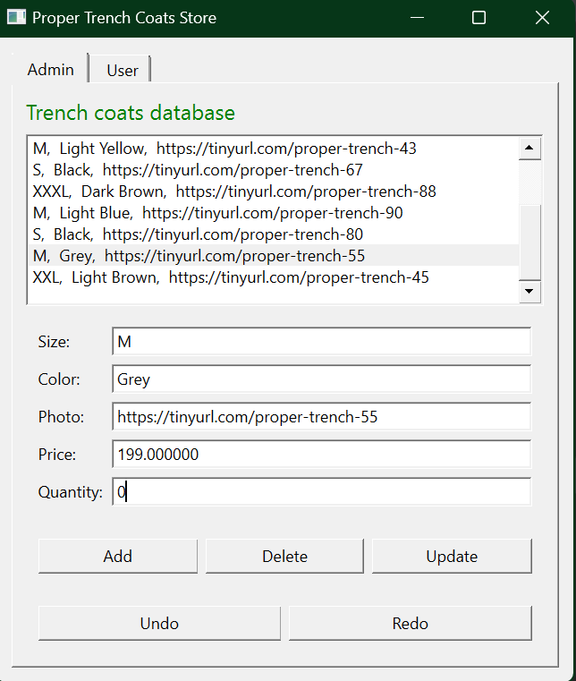

# Trench Coat Store

Simple online store management C++ application created for my OOP university course.      

### Description

An important element of an online store is the shopping cart. 
At startup, the user is given the option of saving the contents of
the cart in CSV or HTML format. 

Choosing one option closes the above window and opens the main window, which
contains the admin and user (_store customer_) tabs.

The **admin tab** provides CRUD functionalities, as well as undo/ redo.

The **user tab** allows filtering based on clothing size.  
The customer is shown one trench coat at a time, browsing through them with the _Next_ button. They can choose
to buy the current coat or to view a photo of it, the latter of which opens the photo in another app.  
The shopping cart contains the products bought by the customer. It can be viewed in the previously chosen format, 
in which case the default app for CSV/ HTML is opened, or in a table format, where a new window is opened.

   

### Technologies

The project is created with:
- C++14
- Qt version: 6.4.2 
